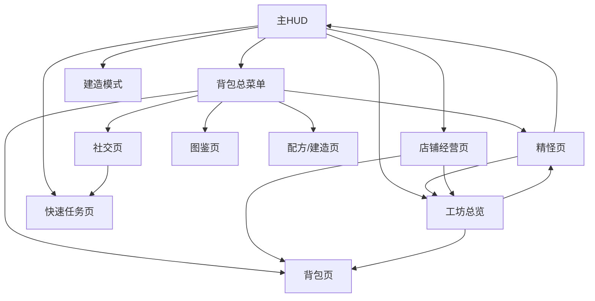
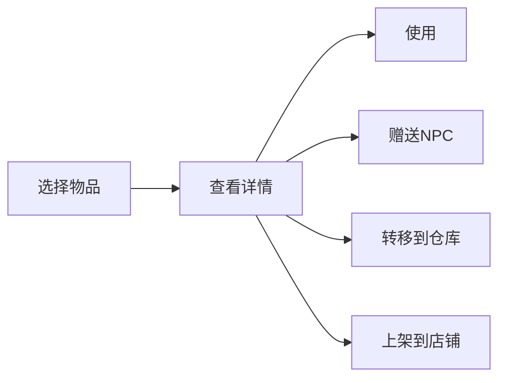
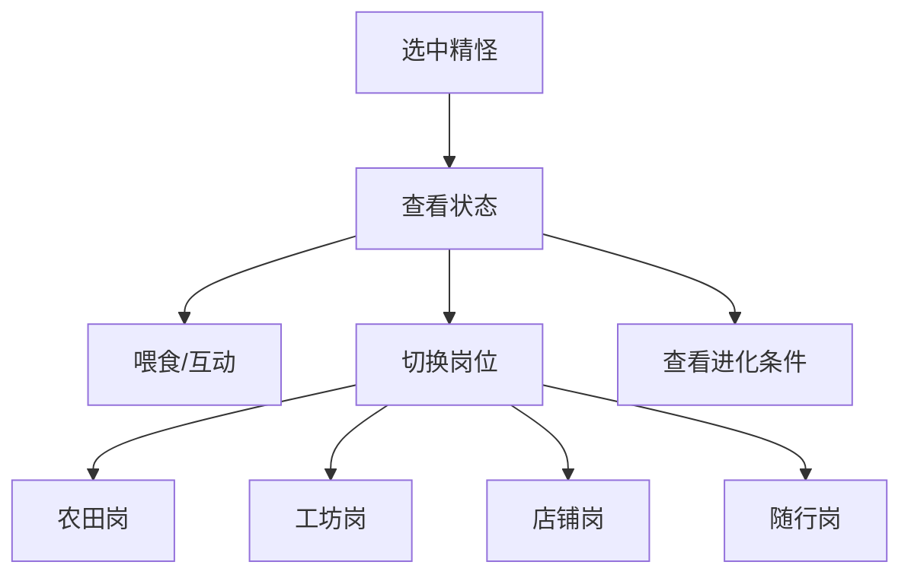
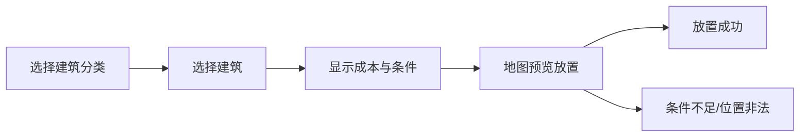
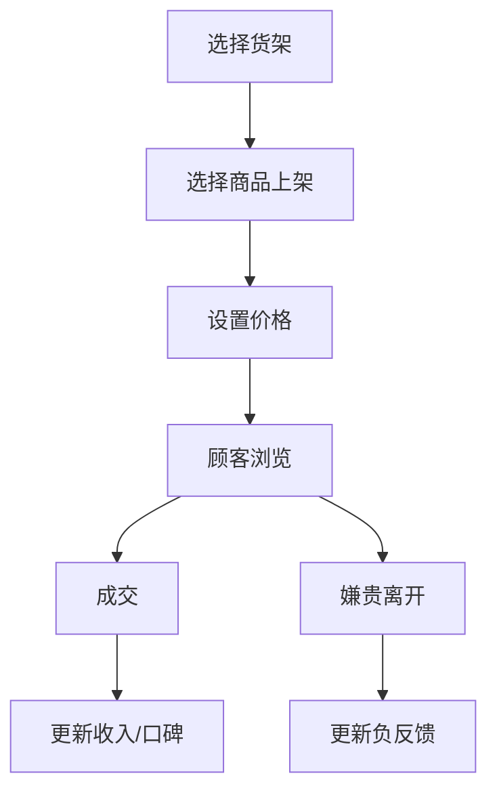
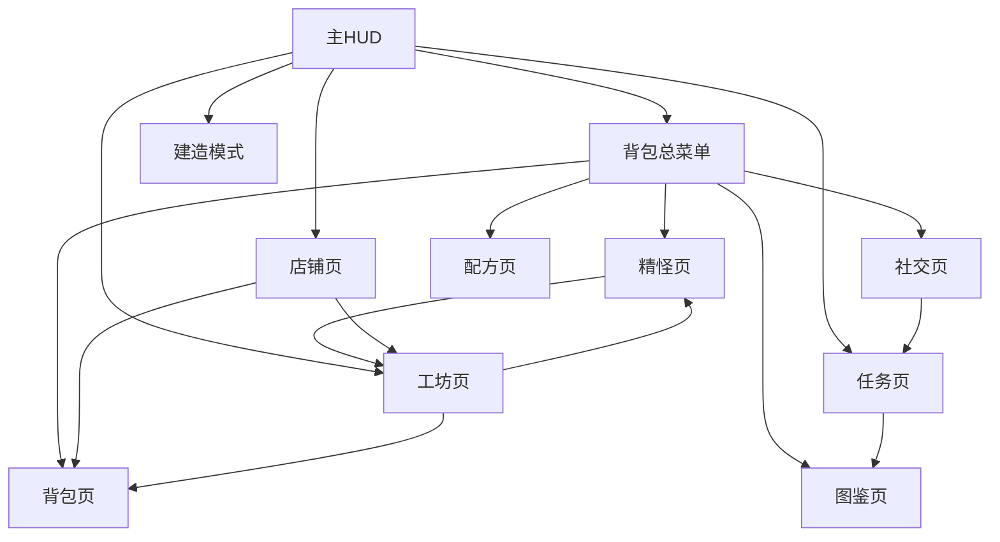

# 《仙农洞天：精怪工坊》UI 低保真线框图

## 0. 文档定位
这份文档是给 UI、程序、策划共用的低保真页面草图。

目标：
- 先对齐信息结构
- 再进入视觉设计
- 降低“文字方案理解偏差”

说明：
- 这里是低保真，不追求美术风格
- 重点看区域划分、信息优先级、交互入口

---

## 1. 页面总导航



---

## 2. 主 HUD 线框

### 2.1 农场 / 大地图 HUD

```text
+-----------------------------------------------------------------------------------+
| [节气盘/天气/日期]                                        [灵石][名望][Buff图标] |
|                                                                                   |
|                                                                                   |
|                              [世界场景 / 玩家 / 精怪]                              |
|                                                                                   |
|                                                                                   |
|                                                                                   |
|                                                                                   |
| [精怪提示]                                                             [任务追踪]  |
| 萝卜精: 干劲90                                                           主线: 修桥 |
| 水灵: 缺食物                                                             支线: 石斛 |
|                                                                                   |
|                           [HP条] [SP条] [状态异常图标]                             |
|                                                                                   |
|                  [1][2][3][4][5][6][7][8][9][0] 快捷栏                             |
+-----------------------------------------------------------------------------------+
```

### 2.2 HUD 设计重点
- 左上只放“时间、节气、天气”，因为这是核心决策信息
- 右上是长期资产信息，不打断操作
- 左下精怪提示只显示异常和重点，不实时刷全量信息
- 右下任务追踪最多 3 条，防止信息噪音

---

## 3. 背包总菜单线框

### 3.1 一级页签结构

```text
+-----------------------------------------------------------------------------------+
| [乾坤袋] [洞天百怪] [凡仙尘缘] [天机残卷] [图鉴录]                                 |
+-----------------------------------------------------------------------------------+
|                                                                                   |
| 左侧信息展示      | 中区主列表 / 网格 / 关系项             | 右侧详情与操作区       |
|                   |                                        |                      |
| 3D模型 / 立绘      | 物品网格 / 精怪列表 / NPC列表 / 配方表     | 描述 / 条件 / 按钮       |
| 当前角色装备位     | 搜索 / 筛选 / 排序                     | 使用 / 赠送 / 排班等     |
| 当前分类说明       |                                        |                      |
|                   |                                        |                      |
+-----------------------------------------------------------------------------------+
| [一键整理] [分类筛选] [排序] [切换页签提示]                                         |
+-----------------------------------------------------------------------------------+
```

---

## 4. 背包页线框

```text
+-----------------------------------------------------------------------------------+
| [乾坤袋]                                                                          |
+-----------------------------------------------------------------------------------+
| [角色模型]        | [全部][作物][食物][药品][材料][工具][任务]                    |
| [武器位]          | +----+ +----+ +----+ +----+ +----+ +----+ +----+ +----+      |
| [玉佩位]          | |物1 | |物2 | |物3 | |物4 | |物5 | |物6 | |物7 | |物8 |      |
| [法宝位]          | +----+ +----+ +----+ +----+ +----+ +----+ +----+ +----+      |
|                   | |物9 | |物10| |物11| |物12| |物13| |物14| |物15| |物16|      |
|                   | +----+ +----+ +----+ +----+ +----+ +----+ +----+ +----+      |
|                   |                                                                |
|                   |                                                                |
|-----------------------------------------------------------------------------------|
| 物品详情: 名称 / 品质 / 售价 / 标签 / 来源 / 用途                                  |
| [使用] [赠送] [上架] [转仓] [丢弃]                                                 |
+-----------------------------------------------------------------------------------+
```

### 4.1 背包页关键流程


---

## 5. 精怪页线框

```text
+-----------------------------------------------------------------------------------+
| [洞天百怪]                                                                        |
+-----------------------------------------------------------------------------------+
| [筛选: 全部/农田/工坊/店铺/战斗/辅助]                                              |
|-----------------------------------------------------------------------------------|
| 精怪列表              | 精怪展示区                    | 管理与详情区               |
| +------------------+ | +--------------------------+ | 名称: 萝卜药童            |
| | 萝卜精  好感3    | | 当前精怪立绘 / 模型         | 阶段: 二阶                 |
| | 辣椒怪  饱食低   | |                            | 饱食: 84/120              |
| | 河伯    空闲     | |                            | 干劲: 95/120              |
| | 搬山怪  工坊中   | |                            | 心情: 90/110              |
| +------------------+ | +--------------------------+ | 岗位: 农田岗               |
|                      |                              | 技能1: 自动浇水            |
|                      |                              | 技能2: 自动收割            |
|                      |                              | 进化条件: 谷雨/好感/素材    |
|                      |                              | [喂食][摸头][换岗][随行]   |
+-----------------------------------------------------------------------------------+
| [岗位总览] [一键喂食] [异常预警] [组合共鸣查看]                                     |
+-----------------------------------------------------------------------------------+
```

### 5.1 精怪页关键流程


---

## 6. 社交页线框

```text
+-----------------------------------------------------------------------------------+
| [凡仙尘缘]                                                                        |
+-----------------------------------------------------------------------------------+
| NPC列表                | NPC 展示区                   | 关系与奖励区               |
| +-------------------+ | +-------------------------+ | 名称: 白芷                 |
| | 许伯   ★★★       | | 立绘 / 模型               | 好感: 3/5                  |
| | 张铁山 ★★        | |                           | 喜好: 药材/清茶            |
| | 白芷   ★★★       | |                           | 当前委托: 高品质石斛       |
| | 陆三笑 ★         | |                           | 3星奖励: 高级药园配方      |
| +-------------------+ | +-------------------------+ | [追踪任务][查看事件]       |
+-----------------------------------------------------------------------------------+
```

---

## 7. 任务页线框

```text
+-----------------------------------------------------------------------------------+
| [任务录] [主线] [支线] [节气] [精怪] [订单]                                         |
+-----------------------------------------------------------------------------------+
| 任务列表                      | 任务详情                                            |
| +--------------------------+ | 标题: 断桥旧木                                      |
| | 主线: 断桥旧木           | | 发布者: 许伯                                      |
| | 支线: 白芷之求           | | 目标1: 木材 50/50                                 |
| | 节气: 惊蛰虫害           | | 目标2: 铁矿 8/10                                  |
| | 订单: 小暑清凉包         | | 目标3: 灵石 1320/2000                             |
| +--------------------------+ | 奖励: 解锁矿洞 / 名望 / 工具升级                    |
|                              | [追踪] [取消追踪]                                   |
+-----------------------------------------------------------------------------------+
```

---

## 8. 图鉴页线框

```text
+-----------------------------------------------------------------------------------+
| [图鉴录] [作物] [精怪] [节气] [秘境]                                                |
+-----------------------------------------------------------------------------------+
| 左侧分类树              | 中区图鉴格子                  | 右侧详情                     |
| 作物                    | [白萝卜][石斛][茶芽][???]     | 名称 / 来源 / 用途 / 标签      |
| 精怪                    | [萝卜精][辣椒怪][???]         | 获取条件 / 进化路线            |
| 节气                    | [立春][惊蛰][谷雨]            | 对应效果 / 市场加成            |
+-----------------------------------------------------------------------------------+
```

---

## 9. 建造模式线框

```text
+-----------------------------------------------------------------------------------+
| [建造模式] [住宅][农用][工坊][精怪][店铺][景观]                                     |
+-----------------------------------------------------------------------------------+
| 建筑列表                 | 地图预览 / 放置区域             | 建筑详情                       |
| +---------------------+ | +----------------------------+ | 名称: 百怪大院                |
| | 草庐                | |    [绿色可放置区域]          | 成本: 灵石/木材/布料           |
| | 仓箱                | |    [红色禁放区域]            | 功能: 精怪宿舍/排班中心        |
| | 灵井                | |    [建筑幽灵体预览]          | 条件: 第三章 / 任务完成        |
| +---------------------+ | +----------------------------+ | [旋转] [放置] [取消]          |
+-----------------------------------------------------------------------------------+
```

### 9.1 建造流程


---

## 10. 店铺经营页线框

```text
+-----------------------------------------------------------------------------------+
| [营业中] [今日收入] [口碑变化] [顾客数] [当前市闻]                                   |
+-----------------------------------------------------------------------------------+
| 货架总览 / 平面图             | 当前顾客队列 / 动态提示      | 商品详情与定价                  |
| +--------------------------+ | 顾客A: 浏览草药             | 商品: 石斛回元散               |
| | 货架1: 生鲜              | 顾客B: 想买饮品             | 基础价: 160                    |
| | 货架2: 药品              | 顾客C: 觉得太贵             | 当前价: 210                    |
| | 货架3: 精品柜            |                             | 热门倍率: +20%                 |
| +--------------------------+ |                             | [调价滑杆]                     |
|                              |                             | [上架][下架][自动补货]         |
+-----------------------------------------------------------------------------------+
| [营业日志] [成交统计] [顾客评价] [一键补货]                                         |
+-----------------------------------------------------------------------------------+
```

### 10.1 店铺流程


---

## 11. 工坊总览页线框

```text
+-----------------------------------------------------------------------------------+
| [工坊总览] [磨坊][药炉][熔炉][织机][酿缸][丹鼎]                                       |
+-----------------------------------------------------------------------------------+
| 设备列表                     | 当前设备详情                   | 精怪加成与队列                 |
| +--------------------------+ | 名称: 药炉                     | 驻扎精怪: 灶神小福精          |
| | 药炉  运行中 34s         | 配方: 止血散                   | 加速: -20%                    |
| | 熔炉  空闲               | 原料: 石斛 x2 水 x1            | 特效: 双倍产出 15%            |
| | 织机  缺原料             | 输出: 止血散 x1                | [更换精怪] [开始生产]         |
| +--------------------------+ | [一键收取] [放入材料]          | [查看全部队列]                |
+-----------------------------------------------------------------------------------+
```

---

## 12. 节气转场提示线框

```text
+------------------------------------------------------------+
|                    [节气切换大面板]                        |
|                    惊蛰 · 虫鸣初醒                         |
| 影响:                                                     |
| 1. 虫害风险提升                                            |
| 2. 大蒜系精怪效果增强                                      |
| 3. 驱虫与防御类商品需求上涨                                |
|                                                            |
| [查看详情]                                    [关闭]       |
+------------------------------------------------------------+
```

---

## 13. 页面流程图



---

## 14. 开发优先级建议

### 第一批必须先做
- 主 HUD
- 背包页
- 精怪页
- 任务页
- 店铺页

### 第二批再做
- 图鉴页
- 社交页
- 工坊总览
- 建造模式

### 第三批做增强
- 节气转场大面板
- 节庆专用页
- 结局与终章大阵特殊 UI

---

## 15. 当前最重要的实现提醒
- 精怪页一定优先“排班效率”，不要先追求华丽
- 店铺页一定要把“定价反馈”做出来，不然卖点会塌
- 任务页和图鉴页最好支持互相跳转
- 建造页必须实时显示缺失材料
