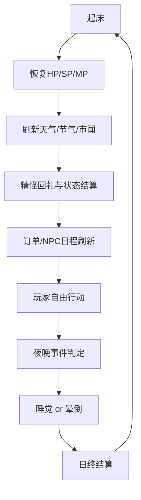
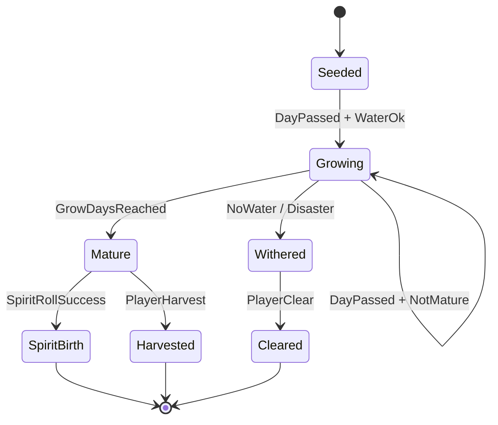
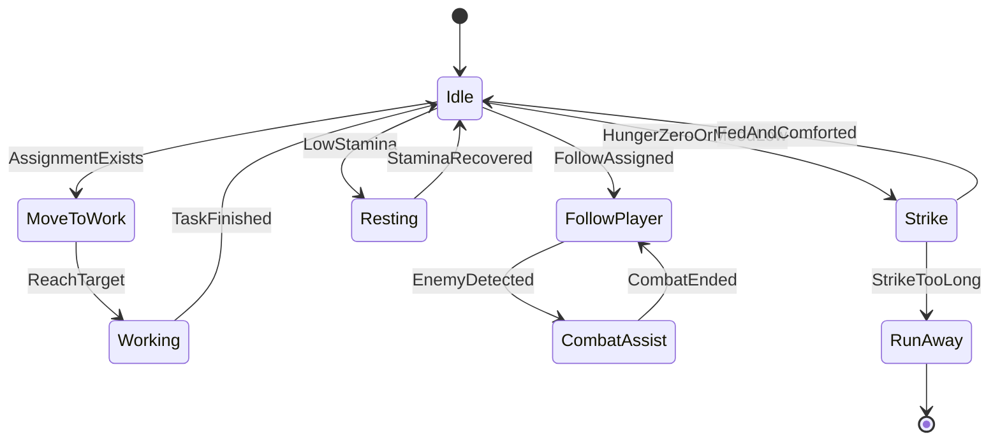
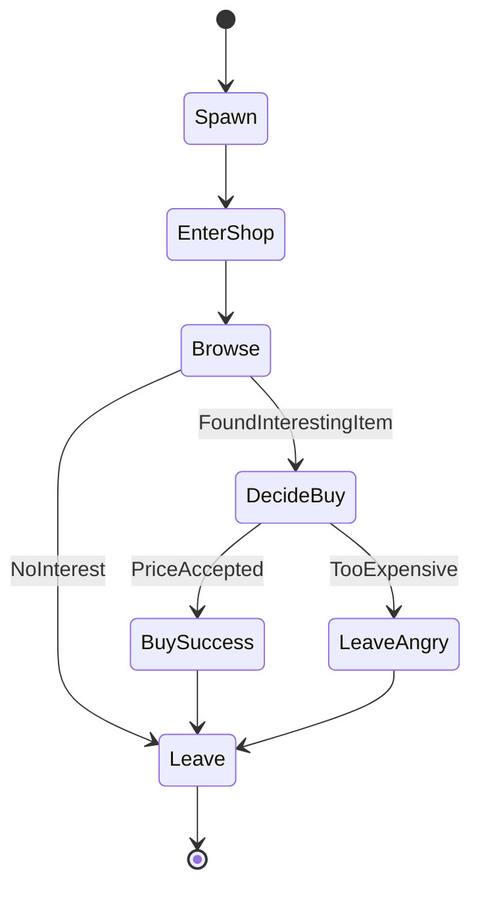
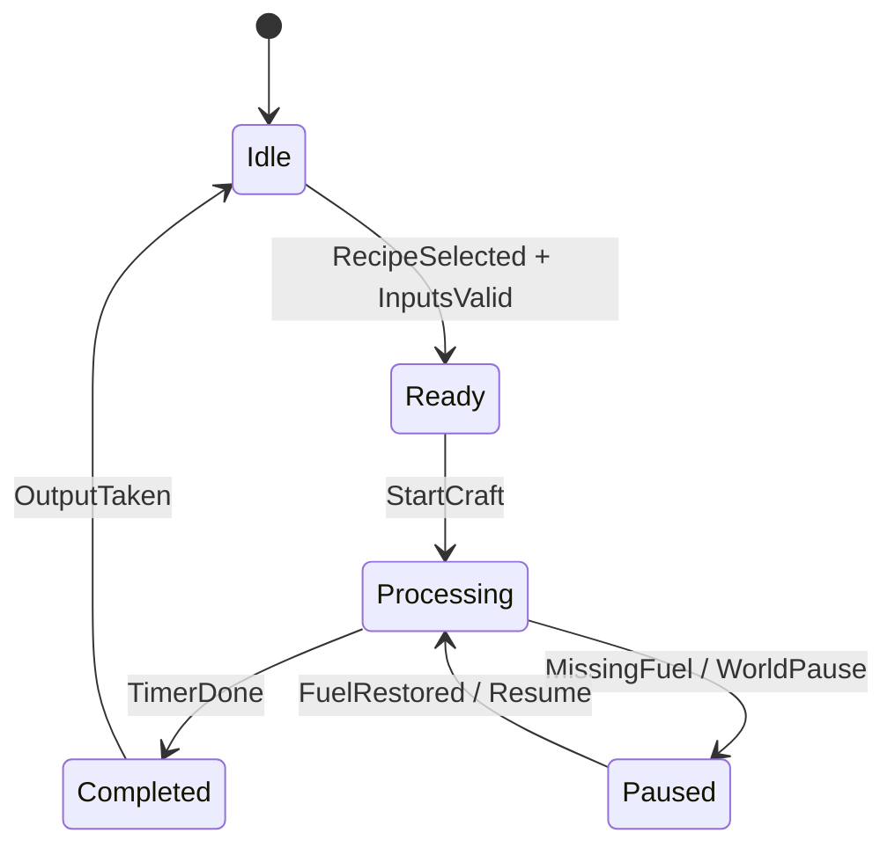
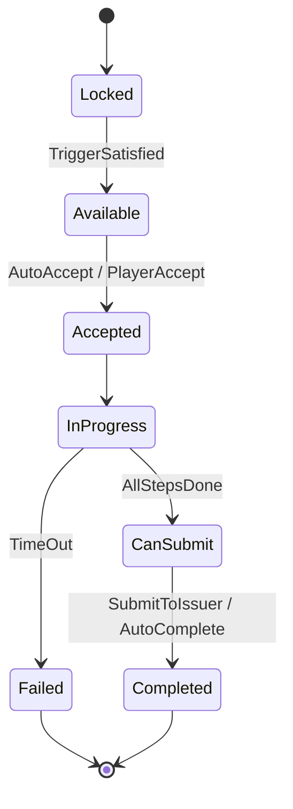
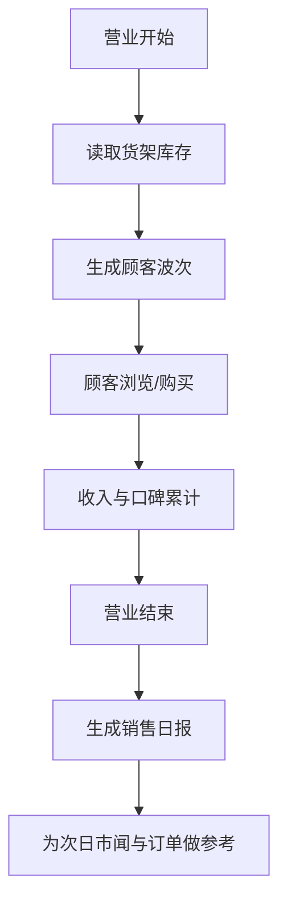
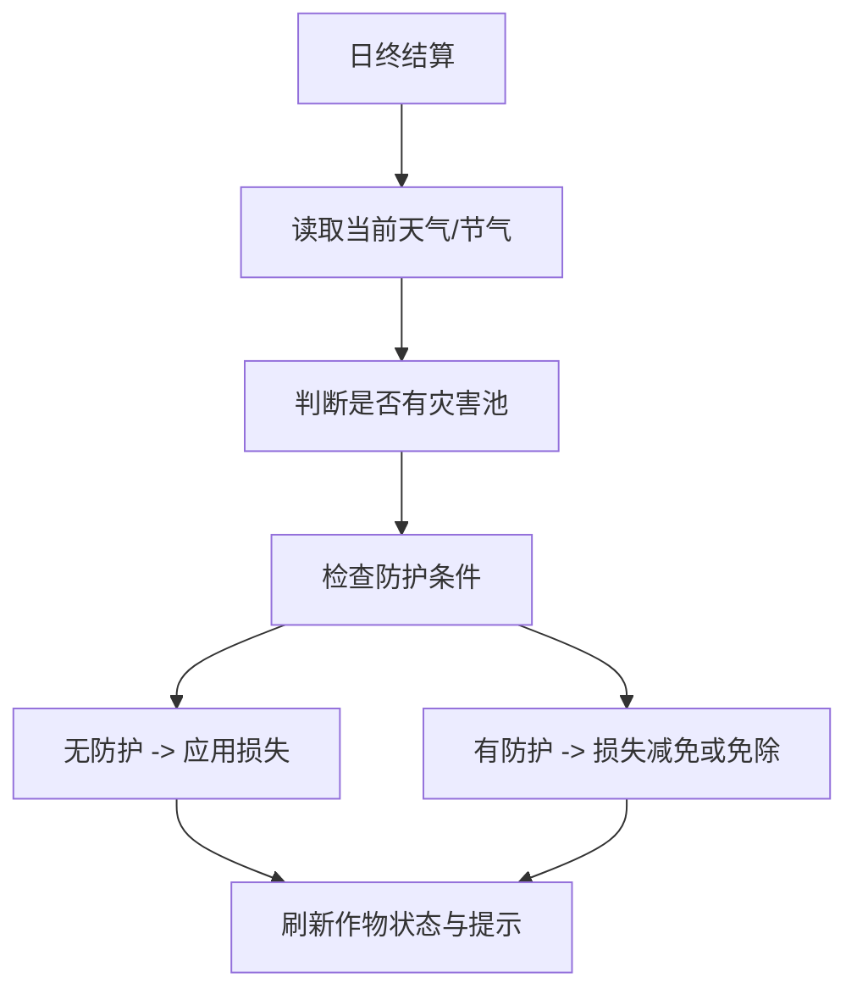
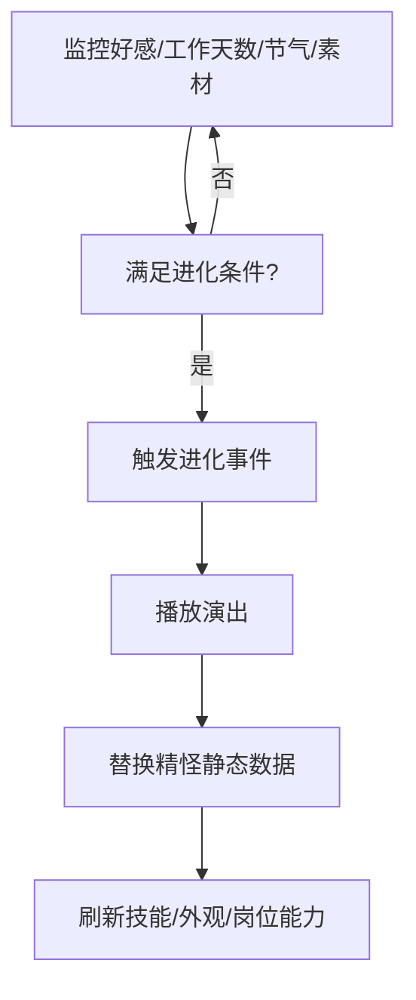
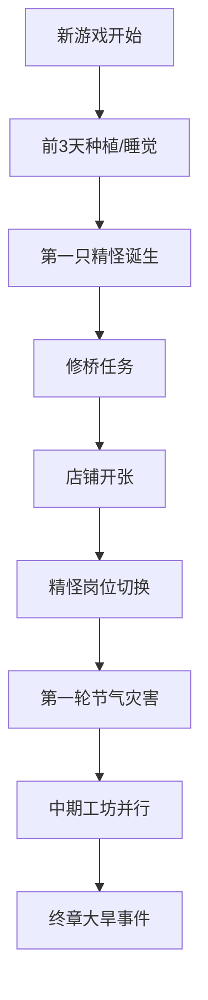

# 《仙农洞天：精怪工坊》核心系统状态流转图

## 0. 文档定位
这份文档把核心系统从文字规则改成状态流转图，方便程序、策划、QA 对齐。

覆盖重点：
- 游戏日循环
- 作物生命周期
- 精怪状态机
- 店铺顾客状态机
- 任务状态流转
- 工坊设备状态机

---

## 1. 游戏日循环

### 1.1 日终结算包含
- 作物成长
- 缺水 / 灾害判定
- 精怪饱食与心情变化
- 店铺营业归档
- 任务计时器推进

---

## 2. 作物生命周期

### 2.1 关键规则
- 品质在 `Mature` 结算
- 成精在 `Mature -> Harvested` 之间判定
- 枯萎不必立即删除，保留为可清理状态

---

## 3. 精怪状态机

### 3.1 精怪运行关键变量
- 饱食
- 干劲
- 心情
- 岗位
- 当前目标

### 3.2 程序侧注意点
- 不同岗位采用不同目标选择器
- `Idle` 状态不要每帧全图搜索目标
- `Strike` 和 `RunAway` 要能被任务系统捕获

---

## 4. 店铺顾客状态机

### 4.1 影响 `DecideBuy` 的因素
- 预算
- 价格敏感度
- 商品标签匹配
- 品质
- 新鲜度
- 市闻加成

---

## 5. 工坊设备状态机

### 5.1 设备结算关键点
- 驻扎精怪效果在 `Processing` 开始时读取
- 双倍产出等概率效果在 `Completed` 时判定

---

## 6. 任务状态流转

### 6.1 设计建议
- 主线基本不进入 `Failed`
- 限时订单和节气活动可进入 `Failed`
- 好感事件尽量允许延期，不要永久卡死

---

## 7. 节气状态切换

### 7.1 节气系统依赖
- 作物成长系统
- 店铺市场系统
- 精怪加成系统
- 任务 / 事件系统

---

## 8. 店铺经营日流程

---

## 9. 农场灾害判定流程

### 9.1 防护来源
- 巡逻精怪
- 火系 / 水系精怪
- 阵法建筑
- 温棚或特定田地

---

## 10. 精怪进化流程

---

## 11. 结算优先级建议

### 11.1 日终结算顺序
1. 任务超时检查
2. 天气 / 节气事件判定
3. 作物成长
4. 灾害结算
5. 精怪状态变化
6. 工坊离线进度
7. 店铺经营归档
8. 次日事件预告

### 11.2 这样排序的原因
- 先定“世界状态”
- 再算“作物结果”
- 再让精怪对结果做后续反馈

---

## 12. QA 优先验证图

### 12.1 关键测试目的
- 检查主流程不断档
- 检查状态机切换无死锁
- 检查世界状态变更能正确影响所有系统

---

## 13. 当前最建议程序先画成真流程图的 3 个系统
- 作物生命周期
- 精怪岗位状态机
- 店铺顾客购买状态机

这 3 个图如果真的被实现清楚，整个项目的核心差异化就已经站住了。
